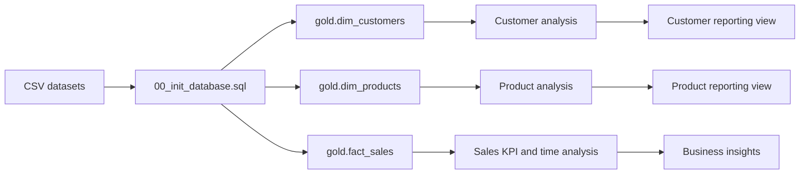

# SQL Data Analytics Project

Designed and implemented a SQL-based retail analytics project to explore customer and product behavior, measure sales performance, and build a lightweight analytical data model in SQL Server. The repository contains a set of T-SQL scripts that create the database, load CSV data, and answer business-focused questions using aggregation, date analysis, segmentation, and reporting views.

## Project Overview

This project was developed to practice and demonstrate core Data Analytics and Data Engineering skills using a realistic sales dataset. The repository models a simple analytical warehouse around customer, product, and sales data and applies SQL techniques to investigate revenue trends, customer value, product performance, and category contribution.

The dataset includes customer profile data, product catalog information, and transaction history. The analysis is structured around a gold-layer schema with a fact table and dimension tables, allowing business questions to be answered through SQL rather than manual spreadsheet analysis.

## Project Objectives

The project focuses on the following objectives:

- Build a SQL Server database and analytical schema from source CSV files
- Load dimensional and fact data into a warehouse structure
- Inspect the database schema and understand table relationships
- Calculate core sales and customer KPIs
- Analyze time-based sales trends and cumulative performance
- Rank top products and customers by business value
- Segment customers and products based on spending and cost profile
- Create reusable reporting views for customer and product analysis

## Technologies & Skills

The project demonstrates the following technologies and SQL/data concepts:

- SQL Server
- T-SQL
- SSMS
- Bulk data loading with BULK INSERT
- Data warehousing basics
- Dimensional modeling
- Fact and dimension tables
- Aggregations and grouping
- Date functions and time-series analysis
- Window functions
- CTEs and subqueries
- CASE logic for segmentation
- Views for analytical reporting
- Customer and product analysis

## Data Architecture / Data Model

The repository uses a gold-layer warehouse structure based on three core tables:

- gold.dim_customers
- gold.dim_products
- gold.fact_sales

These tables form the analytical foundation for the project.

### Fact and dimension design

- gold.dim_customers stores customer profile information such as name, country, gender, marital status, and birthdate.
- gold.dim_products stores catalog information such as product name, category, subcategory, cost, and product line.
- gold.fact_sales stores transactional sales records including order dates, quantity, sales_amount, and the keys linking to the customer and product dimensions.

This structure reflects a dimensional model commonly used in modern analytics environments, where fact tables store measurable events and dimension tables store descriptive attributes.



## What I Implemented

The project includes the practical implementation of a complete SQL analytics workflow:

- Created the DataWarehouseAnalytics database and the gold schema
- Built the core warehouse tables for customers, products, and sales
- Loaded structured CSV data into SQL Server using BULK INSERT
- Explored the database and table metadata to understand the available fields and schema
- Calculated total sales, total quantity, average price, total orders, and customer/product counts
- Analyzed the date range and historical coverage of the order data
- Evaluated category and customer distributions to understand volume and concentration
- Ranked products and customers by total revenue and order activity
- Applied time-based analysis using year and month grouping, cumulative totals, and moving averages
- Implemented customer and product segmentation logic using CASE expressions
- Examined category contribution to total sales using part-to-whole calculations
- Created analytical views for customer and product reporting

This work was implemented as a set of sequential SQL scripts, each focused on a specific analytical task, allowing the project to progress from data loading to insight generation.

## Business Questions

The SQL analysis was designed to answer business questions such as:

- Which countries have the largest customer base?
- Which product categories contribute the most to total revenue?
- Which customers generate the highest sales volume?
- Which products rank highest in sales performance?
- How do sales evolve over time by month or year?
- How do rankings and trends change across different product lines?
- Which customer segments are high-value, regular, or new?
- What share of total sales comes from each product category?
- Which products or customers are performing above or below average?

## Key Results / Insights

The repository contains the SQL logic needed to generate these insights, but it does not include a final dashboard or exported result tables. The analysis is intentionally structured to support the following types of findings:

- revenue concentration by category and customer,
- top-performing products and customers by sales contribution,
- monthly and yearly sales trends,
- cumulative revenue progression over time,
- customer segmentation based on purchase behavior and lifespan,
- product cost segmentation and category performance,
- customer and product reporting views summarizing key business KPIs.

The scripts specifically include measures such as total sales, quantity sold, average selling price, customer counts, product counts, recency, and average order value, with logic to support ranking and segmentation analysis.

## Repository Structure

```text
SQL_Data_Analytics/
├── README.md
├── datasets/
│   ├── DataWarehouseAnalytics.bak
│   └── csv_files/
│       ├── bronze.crm_cust_info.csv
│       ├── bronze.crm_prd_info.csv
│       ├── bronze.crm_sales_details.csv
│       ├── bronze.erp_cust_az12.csv
│       ├── bronze.erp_loc_a101.csv
│       ├── bronze.erp_px_cat_g1v2.csv
│       ├── gold.dim_customers.csv
│       ├── gold.dim_products.csv
│       ├── gold.fact_sales.csv
│       ├── gold.report_customers.csv
│       ├── gold.report_products.csv
│       ├── silver.crm_cust_info.csv
│       ├── silver.crm_prd_info.csv
│       ├── silver.crm_sales_details.csv
│       ├── silver.erp_cust_az12.csv
│       ├── silver.erp_loc_a101.csv
│       └── silver.erp_px_cat_g1v2.csv
├── scripts/
│   ├── 00_init_database.sql
│   ├── 01_database_exploration.sql
│   ├── 02_dimensions_exploration.sql
│   ├── 03_date_range_exploration.sql
│   ├── 04_measures_exploration.sql
│   ├── 05_magnitude_analysis.sql
│   ├── 06_ranking_analysis.sql
│   ├── 07_change_over_time_analysis.sql
│   ├── 08_cumulative_analysis.sql
│   ├── 09_performance_analysis.sql
│   ├── 10_data_segmentation.sql
│   ├── 11_part_to_whole_analysis.sql
│   ├── 12_report_customers.sql
│   ├── 13_report_products.sql
│   └── placeholder
└── README.md
```

## How to Run

### Requirements

- Microsoft SQL Server
- SQL Server Management Studio (SSMS) or another SQL Server client
- Permissions to create and drop databases
- Local filesystem access for BULK INSERT operations

### Setup steps

1. Open the database creation script in SSMS or another SQL client.
2. Update all BULK INSERT file paths to match the local repository location on the machine running SQL Server.
3. The script currently references a path format similar to:

```sql
C:\sql\sql-data-analytics-project\datasets\csv-files\gold.dim_customers.csv
```

In this repository, the CSV files are stored under `datasets/csv_files`, so the path should be adjusted to the local environment before execution.

4. Run the scripts in the following order:

```sql
00_init_database.sql
01_database_exploration.sql
02_dimensions_exploration.sql
03_date_range_exploration.sql
04_measures_exploration.sql
05_magnitude_analysis.sql
06_ranking_analysis.sql
07_change_over_time_analysis.sql
08_cumulative_analysis.sql
09_performance_analysis.sql
10_data_segmentation.sql
11_part_to_whole_analysis.sql
12_report_customers.sql
13_report_products.sql
```

5. Verify that the database `DataWarehouseAnalytics` is created and that the `gold` schema tables are populated.

## SQL Concepts Demonstrated

This project applies a practical set of SQL techniques used in analytical and data engineering work:

- CREATE DATABASE and CREATE TABLE statements
- BULK INSERT for loading CSV-based source data
- SELECT with filtering and ordering
- GROUP BY and aggregate functions
- COUNT, SUM, AVG, MIN, MAX, and DISTINCT
- Date functions such as YEAR, MONTH, DATEDIFF, and DATETRUNC
- Window functions including SUM() OVER(), AVG() OVER(), and LAG()
- Ranking logic using ORDER BY and top-N queries
- CASE expressions for segmentation and business logic
- CTEs to structure multi-step analytical queries
- Views to build reusable reporting outputs

## What This Project Demonstrates

This project demonstrates a strong foundation in SQL analytics and data preparation for internship-level work in Data Analytics and Data Engineering. It shows the ability to:

- design a simple warehouse structure from raw data,
- load analytic datasets into SQL Server,
- perform exploratory analysis on real business data,
- build KPI and trend analysis using SQL,
- structure queries for business reporting,
- apply segmentation and ranking logic in a data-driven way.

It is not presented as a full production data platform, but it reflects a realistic analytical workflow that is commonly used in reporting, BI, and data engineering contexts.

## Future Improvements

Potential next steps for this project include:

- adding automated data quality checks and validation queries,
- creating a dashboard or Power BI reporting layer on top of the warehouse,
- implementing a more formal data pipeline with orchestration,
- expanding the schema with additional dimensions or fact tables,
- moving the project to a cloud-based warehouse workflow such as Azure SQL or Synapse.

These are future improvements rather than completed work in the current repository.

---

This project reflects a practical SQL analytics workflow designed to explore a retail sales dataset, answer business questions, and demonstrate analytical thinking in a portfolio-ready format.
